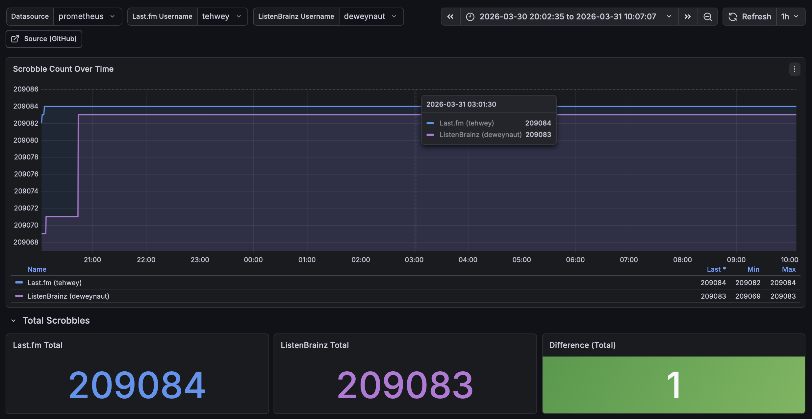

# scrobble-exporter

Prometheus exporter that monitors music scrobble counts across platforms to detect divergence.

## Metrics

| Metric | Type | Labels | Description |
|---|---|---|---|
| `scrobble_plays_total` | Gauge | `service`, `username` | Total all-time play count |
| `scrobble_scrape_errors_total` | Gauge | `service`, `username`, `status_code` | 1 if last scrape failed, 0 on success |

`status_code` is the HTTP status code as a string (`"429"`, `"500"`) or `"0"` for non-HTTP errors (timeout, DNS, decode failure).

### Example PromQL

```promql
# Alert if any scrape is failing
scrobble_scrape_errors_total == 1

# Alert if play counts diverge by more than 10 between services
abs(
  scrobble_plays_total{service="lastfm", username="alice"}
  -
  scrobble_plays_total{service="listenbrainz", username="alice"}
) > 10
```

## Configuration

### Environment variables

| Variable | Required | Description |
|---|---|---|
| `LASTFM_API_KEY` | Yes (for Last.fm) | App-level API key from last.fm/api |
| `LASTFM_USERNAMES` | Yes (for Last.fm) | Comma-separated usernames to monitor |
| `LISTENBRAINZ_USERNAMES` | Yes (for Listenbrainz) | Comma-separated usernames to monitor |

Scrapers are skipped (with a warning) if their env vars are missing — no crash.

### Flags

| Flag | Env var | Default | Description |
|---|---|---|---|
| `--listen-address` | `LISTEN_ADDRESS` | `:9101` | Address to expose metrics on |
| `--metrics-path` | `METRICS_PATH` | `/metrics` | Path to expose metrics on |

## Running with Docker

```sh
docker run \
  -e LASTFM_API_KEY=your_key \
  -e LASTFM_USERNAMES=alice,bob \
  -e LISTENBRAINZ_USERNAMES=alice,bob \
  -p 9101:9101 \
  ghcr.io/dewey/scrobble-exporter:latest
```

## Running from source

```sh
go build -o scrobble-exporter .
```

```sh
LASTFM_API_KEY=your_key \
LASTFM_USERNAMES=alice \
LISTENBRAINZ_USERNAMES=alice \
./scrobble-exporter
```

## Endpoints

| Path | Description |
|---|---|
| `/metrics` | Prometheus scrape endpoint |
| `/up` | Returns `200 OK` if the process is alive (for liveness probes) |
| `/` | Lists active scrapers and links to `/metrics` |

## Grafana dashboard

A pre-built dashboard is included at [`dashboards/scrobble-comparison.json`](dashboards/scrobble-comparison.json).



It provides:

- **Scrobble Count Over Time** — time series comparing Last.fm and ListenBrainz play counts
- **Total Scrobbles** — current totals for each service and the absolute difference (green/yellow/red threshold colouring)
- **Divergence Over Time** — signed difference (Last.fm − ListenBrainz) over the selected time range

Variables are auto-populated from Prometheus label values, so usernames are selectable from dropdowns without editing the dashboard.

Import via Grafana UI → Dashboards → Import → Upload JSON file, or provision it via your Grafana configuration.

## Adding a new service

1. Create `collector/<service>.go`
2. Implement the `Scraper` interface (`ServiceName()`, `Username()`, `Scrape(ctx) (PlayCounts, error)`)
3. Register it in `main.go` — read credentials from env vars, append one instance per user to the scrapers slice

No other files need to change.
